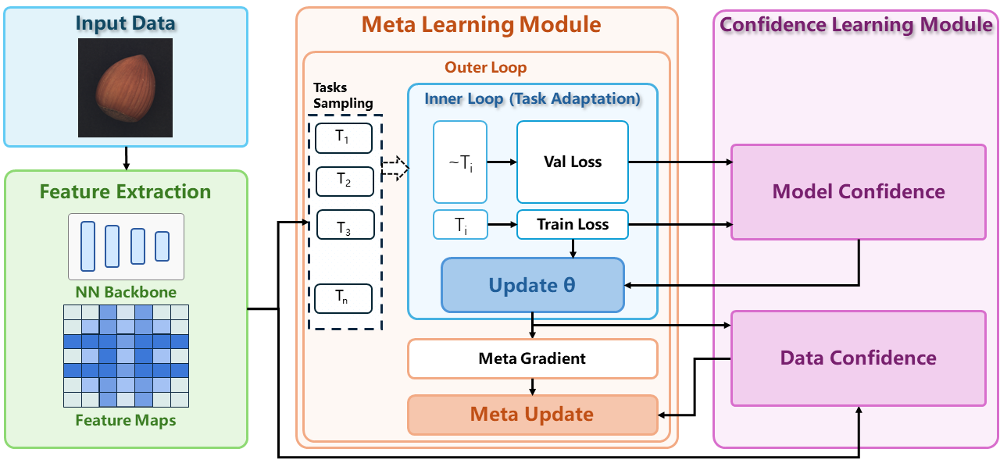

# CoMet



Towards Real Unsupervised Anomaly Detection Via Confident Meta-Learning

Muhammad Aqeel, Shakiba Sharifi, Marco Cristani, Francesco Setti

[Paper](https://openaccess.thecvf.com/content/ICCV2025/html/Aqeel_Towards_Real_Unsupervised_Anomaly_Detection_Via_Confident_Meta-Learning_ICCV_2025_paper.html)


Abstract

So-called unsupervised anomaly detection is better described as semi-supervised, as it assumes all training data are nominal. This assumption simplifies training but requires manual data curation, introducing bias and limiting adaptability. We propose Confident Meta-learning (CoMet), a novel training strategy that enables deep anomaly detection models to learn from uncurated datasets where nominal and anomalous samples coexist, eliminating the need for explicit filtering. 

Our approach integrates Soft Confident Learning, which assigns lower weights to low-confidence samples, and Meta-Learning, which stabilizes training by regularizing updates based on training-validation loss covariance. This prevents overfitting and enhances robustness to noisy data. CoMet is model-agnostic and can be applied to any anomaly detection method trainable via gradient descent. 

Experiments on MVTec-AD, VIADUCT, and KSDD2 with two state-of-the-art models demonstrate the effectiveness of our approach, consistently improving over the baseline methods, remaining insensitive to anomalies in the training set, and setting a new state-of-the-art across all datasets.


Installation

Environment Requirements:
- Python 3.8
- torch 1.12.1
- torchvision 0.13.1
- numpy 1.22.4
- opencv-python 4.5.1

Install dependencies:
```
pip install -r requirements.txt
```

Note: Above versions are tested, but other versions may also work.


Datasets

[MVTec-AD](https://www.mvtec.com/company/research/datasets/mvtec-ad)

[KSDD2](https://www.vicos.si/resources/kolektorsdd2/)

[VIADUCT](https://fordatis.fraunhofer.de/handle/fordatis/363)

All datasets should maintain their original folder structure. Update dataset paths in `run.sh` before training.


Training

1. Edit `run.sh` to specify dataset class, dataset path, and log folder
2. Run training:
```
bash run.sh
```

The default configuration is set for MVTec-AD dataset.


Citation

If you find this work useful, please cite:
```
@InProceedings{Aqeel_2025_ICCV,
    author    = {Aqeel, Muhammad and Sharifi, Shakiba and Cristani, Marco and Setti, Francesco},
    title     = {Towards Real Unsupervised Anomaly Detection Via Confident Meta-Learning},
    booktitle = {Proceedings of the IEEE/CVF International Conference on Computer Vision (ICCV)},
    month     = {October},
    year      = {2025},
    pages     = {4858-4867}
}
```


Acknowledgement

This work builds upon [SimpleNet](https://github.com/DonaldRR/SimpleNet). We thank the authors for their excellent work.


License

MIT License
